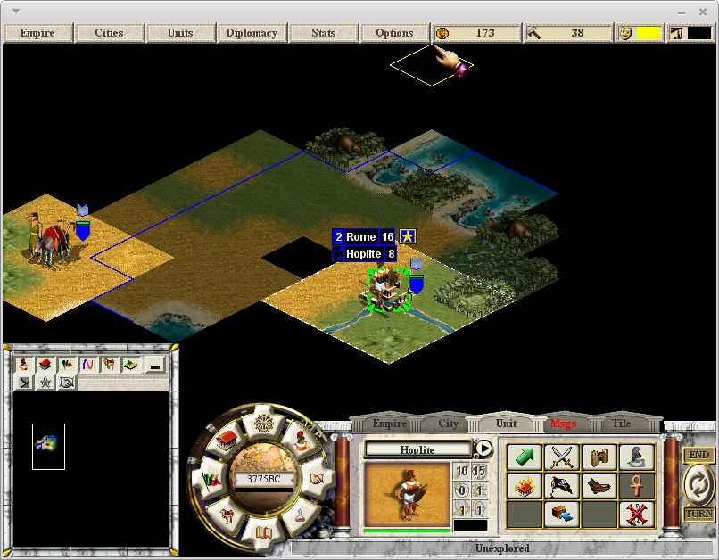
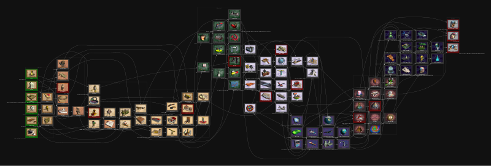

[](https://travis-ci.com/civctp2/civctp2)

## Apolyton Call to Power II Source Code Project

#### CivCTP2
- Git SVN import of http://ctp2.darkdust.net/anonsvn/
- Originally hosted at: https://ctp2.darkdust.net/
- Forums: https://apolyton.net/forum/other-games/call-to-power-2/ctp2-source-code-project

### Original readme files
- [Activision CTP2 Source Code_Readme.txt](https://github.com/civctp2/civctp2/blob/master/Activision%20CTP2%20Source%20Code_Readme.txt)
- [Apolyton CTP2 Source Code_Readme.txt](https://github.com/civctp2/civctp2/blob/master/Apolyton%20CTP2%20Source%20Code_Readme.txt)

## Latest release

The latest release is the [Apolyton Edition 2025-01-20](https://github.com/civctp2/civctp2/releases/tag/Apolyton-Edition-2025-01-20). You have installation files for Windows and Linux. The Linux version does not support the CD, so if you have the CD-version and you want to enjoy the music and the videos yo have to install them. Instructions are in the section [Install the music and videos](#install-the-music-and-videos). If you have the GOG-version then don't worry everything is already in place.

## About

This is the Apolyton version of the *Call to Power II* (CTP2) source code based on the released source code from Activision, that did not include the patch. The code has been stripped of comments, but is otherwise complete as far as Activision's code goes. It was originally built with Microsoft Visual Studio 6.0. In the mean time the Apolyton code was modified so that it works with later versions.
This version also builds on Linux (i386 and x86_64), Ubuntu, Pandora, and Pyra.

On Linux and Windows, CTP2 builds as 32 and 64 bit application, these use SDL2 for display. On Windows also legacy Direct X builds are available. These are mainly for reference to check that the SDL port is complete. The Direct X versions build as 32 and 64 bit versions. However, CTP2 requires 16 bpp graphics support, which is only available for 32 bit programs, and thus 64 bit CTP2 Direct X versions refuse to start.

Note that the game files are not included in this repository, you can get them from the original CD or from the [GoG version](https://www.gog.com/game/call_to_power_2).




## Clone and complete your working copy

First, clone this repository into a directory of your choice. It will contain, beside some others, the following subdirectories:

* `ctp2_code`
* `ctp2_data`
* `Scenarios`

The directory `ctp2_code` contains the source code and will contain the generated executable. The directory `ctp2_data` contains the data files, such as sounds, images, and the database text files that contain all data for the game objects such as move points for units.

Even so the source code of CTP2 has been published, CTP2 is not free software. That means, we cannot distribute CTP2 and its code as a standalone product. Therefore, you have to add in the missing components from your copy of CTP2.

If you already have a copy of CTP2 installed, you can just copy everything from this repository into your installation, which is typically found in `C:\Program Files\Activision\Call to Power II\`.

If you do not have a copy already installed, you can get the files from the CD. The CD contains two files civlang.ctp and civmain.ctp (the extensions might differ). These files are zip files. The file civmain.ctp contains all files that are common to all language versions, civlang.ctp contains all files specific to your language version. Unzip these files and copy their content over your working copy without replacing files that already exist.

If you have the GoG version, use `innoextract` to extract all the required files (you can `sudo apt install innoextract` if you need) from the `setup_call_to_power2_2.0.0.13.exe` windows installer.
For example `innoextract -m -I app  setup_call_to_power2_2.0.0.13.exe` will extract the `app`folder that contains all the game files, which are in the same subfolders as in the CD version: `ctp2_data`, `ctp2_program` and `Scenarios`. Copy these folders over your working copy without replacing files that already exist. Now you should have those directories in your working copy.

* `ctp2_code`
* `ctp2_data`
* `Scenarios`
* `ctp2_program`

The folder `ctp2_program` is a stripped down version of `ctp2_code` without the source code and is the version that was shipped with the game. It is not needed for compiling and running the game. If it is an from a previous installation and you have some save games you want to use in your working copy then copy the folder `/ctp2_program/ctp/save/` and all its content to `/ctp2_code/ctp/save/`.

## Install the music and videos

The Windows version supports CD audio music, and the Linux version supports ripped CD music files compressed as ogg (like found in the GoG version). The Audio tracks in the GoG version are named `Track02.ogg` to `Track11.ogg` and in the `ctp2_program/ctp/music` folder, which should be copied to `ctp2_code/ctp/music`, if you want to use them in your working copy.

The music and the videos are not needed for the playing CTP2. However, if you want to use them you can just use the CD on Windows. However, the GoG audio tracks are not supported on Windows, but you can play them in another player such as VLC, while playing the game.

As the Linux version does not support direct play from the CD-ROM, you need to rip the music-files from the CD and put them on your disk. The music-files can be ripped with [`crip`](http://bach.dynet.com/crip/) or `cdparanoia`.

Alternatively, you can download the music-files from YouTube. For that, go in the terminal to the directory `ctp2_code/ctp/music` (create it if necessary) and run the following code:

```
youtube-dl  -x -t -i --audio-format vorbis --audio-quality 0 'https://www.youtube.com/watch?v=DtQBlVirrkU&list=PL5Z8d0ZfZ8SbHNEFnlR3jckHDmuZjBUaT'
mln -s 'Call to Power 2 - * - *' Track{#1+1}.ogg
i=11; files=(Track*.ogg); for ((f=${#files[@]}-1; f>=0; f--)); do track=$(printf "Track%02d.ogg" $i); mv "${files[$f]}" $track; ((i--)); done
```

You may have to install `youtube-dl` and `mln`.

If you want to play the videos in the game, copy them from the directory `Setup/data/Max/ctp2_data/default/videos/` on the CD to `ctp2_data/default/videos/` of your installation. You can also do this on Windows if you do not want to have the CD in your drive.

You may have to re-encode the videos, however we are not sure about that, because we do not have a CD and a working CD-ROM drive to test it. It might be enough to install the right codec. For re-encoding you can execute the following line from the `ctp2_data/default/videos/` directory:

```
shell> for i in `ls /media/cdrom/Setup/data/Max/ctp2_data/default/videos/`; do mencoder -ovc lavc -lavcopts vcodec=mpeg4  -srate 44100 -af resample=44100 -oac lavc  /media/cdrom/Setup/data/Max/ctp2_data/default/videos/$i -o $i; done 
```

This will also copy the videos to that directory.

## Building on Windows

CTP2 was originally built on Windows with Visual Studio 6. Today, the code compiles on Visual Studio 2017 and 2019 and probably also later. The code has not been compiled on Windows with any other compiler than the Visual Studio compiler. Beside a version of Visual Studio you need:

1. The Windows SDK installed on your computer
2. Install Nasm if you want to build SDL builds. A zip-file with the 64 bit windows version and its license is included in the root directory of this repository. You can get the latest version from http://www.nasm.us/pub/nasm/releasebuilds/<!-- Comment so that full stop does not fuse to the URL -->. The two executables inside go into C:\Program Files (x86)\Microsoft Visual Studio\2017\Enterprise\VC if you use the 32 bit version of Visual Studio 2017. Adjust the path accordingly if you use a later version or the 64 bit version.
2. An environment variable named CDKDIR on your computer. In Windows XP/2000, go to Control
Panel->System->Environment Variables, and add it, with it's value set to [your source path]/ctp2/bin, the directory with bison, flex, and other tools in it. On Windows 10 it is Control
Panel->System->Advanced System Settings->Environment Variables or PC Settings->Info->Advanced System Settings->Environment Variables or press Windows+Pause ->Advanced System Settings->Environment Variables
3. A tmp directory in the root directory of the hard drive or SSD where the code is. If your source code working copy is on drive C: then create C:\tmp. If you have the code on another drive such as E: than it is E:\tmp.

Once all these are in place, open the Visual Studio project file [your source path]/ctp2_code/ctp/civctp.sln in Visual Studio. The project comes with several configurations for several platforms.

The platforms are Win32, x64, ARM, and ARM64. Currently the code compiles on all platforms, but it does not link on ARM and AM64 as the library files for SDL2 and FFmpeg. A possibility would be to integrate the source of `SDL2` and compile the libraries with the project. `FFmpeg` requires Nasm that produces assembler files for various x86 based platforms, unfortunately not for ARM. `FFmpeg` is for video support and can be disabled if the preprocessor macro and the "..\msvc\lib\*" libraries are removed from the project settings. If build on ARM/ARM64 you need ARM/ARM64 version of `flex` and `byacc`.

The configurations are:

* Debug: (DirectX build) Unoptimized debug build, with logging, asserts, and a memory leak detector.
* Final: (DirectX build) The build that was shipped with the game.
* Logging: (DirectX build) Like Final but with logging, which is very useful for AI debugging.
* Release: (DirectX build) Not really needed, it is close to the Final version but does not include the CD check that the Final version originally includedand, it is unoptimized, and seems to include some testing features.
* Debug-SDL: (SDL build) Unoptimized debug build, with logging, asserts, and a memory leak detector.
* Final-SDL: (SDL build) The build that was shipped with the game.
* Logging-SDL: (SDL build) Like Final but with logging, which is very useful for AI debugging.

These configurations generate the executables in [your source path]/ctp2_code/ctp/ for Win32 and in [your source path]/ctp2_code/ctp/x64/ for x64 builds. The executables are called:
<br>

| Configuration   | Executable      |
|-----------------|-----------------|
|Debug            | ctp2-dbg-dx.exe |
|Final            | ctp2-dx.exe     |
|Logging          | ctp2-dbg-dx.exe |
|Release          | ctp2-log-dx.exe |
|Debug-SDL        | ctp2-dbg.exe    |
|Final-SDL        | ctp2.exe        |
|Logging-SDL      | ctp2-log.exe    |

CTP2 can directly be run from Visual Studio, to do so press F5 if you want to run it on the debugger, which will be slow and does not make sense for a Final version. To run without debugging, press Ctrl F5. If necessary, CTP2 will be built, first. Make sure that the start project is set to ctp2, it should be bold in the side menu, otherwise Visual Studio may try to start something else such as Crater.dll, and since it is a dll it will not start. 

## Building on Linux...

**Using flatpak**

Flatpak should streamline the process, as the libraries are managed by the manifest, and the commands are the same on all distros.

To rehearse:

1. Clone this repository and unzip it
2. Paste the CD/GoG game data over the unziped directory, _without replacing_ the downloaded repo files
3. Run `flatpak install org.flatpak.Builder org.freedesktop.Sdk/x86_64/24.08 org.freedesktop.Platform/x86_64/23.08` to satisfy the dependencies.
4. Run `flatpak run org.flatpak.Builder --install --user --force-clean "build/" "net.apolyton.civctp2.yaml"`. This will take a while to compile everything.
5. Finally, `flatpak run net.apolyton.civctp2` will run the game!


**Using the autogen as-is**

You will probably need GCC 5.x or later to build. The code doesn't seem to build on GCC 4.8.

You will need SDL 2.0, SDL_Mixer 2.0, SDL_Image 2.0. To be able to play movies you also need ffmpeg libraries (some).
You will also need `byacc` and `flex`.
On Debian and friends, use `sudo apt install libsdl2-dev libsdl2-mixer-dev libsdl2-image-dev libtiff-dev libavcodec-dev libavformat-dev libswscale-dev byacc flex` to install them all.

The build itself is pretty classing and straight forward:

```
./autogen.sh
CFLAGS="$CFLAGS -O3 -fuse-ld=gold" CXXFLAGS="$CXXFLAGS -fpermissive -O3 -fuse-ld=gold" ./configure --enable-silent-rules
make -j$(nproc)
```

If you want to build a debug version it is:

```
./autogen.sh
CFLAGS="$CFLAGS -O0 -fno-omit-frame-pointer -fuse-ld=gold" CXXFLAGS="$CXXFLAGS -fpermissive -O0 -fno-omit-frame-pointer -fuse-ld=gold" ./configure --enable-silent-rules --enable-debug
make -j$(nproc)
```

Most optimizations are completely disabled at -O0 even if individual optimization flags are specified. In case CTP2 becomes to slow to be useful you can use higher levels of optimization such as -O1, or -O2.

You can look at `./configure` for options, but there aren't many.

Also, note that `make -j$(nproc)` may fail the first time. Some files are auto-generated and the make dependencies don't catch that.

Finally, you may have to use gold instead of ld for link (add `-fuse-ld=gold` to your CFLAGS & CXXFLAGS if needed).

When the build is over, you have to copy the mapgen libraries from `ctp2_code/mapgen/.libs/*.so` to `ctp2_code/ctp/dll/map/`. So do something like `cp -v ctp2_code/mapgen/.libs/*.so ctp2_code/ctp/dll/map/` if you are in the base directory of your working copy. This must be done manually, even so the libraries should be created there, automatically (not implemented/bug).

If you get the message on the terminal: `Failed to load module "atk-bridge"`. Install at-spi with `sudo apt install at-spi`.

### Running

When everything is ready, simply go to the program folder, for example with `cd ~/ctp2/ctp2_code/ctp` and launch the game with `./ctp2` or you can also type `./ctp2_code/ctp/ctp2` ifyour in the folder `~/ctp2/`.

### Installation

CTP2 can be installed on your Linux computer for all users in principle. Just run `make install` in the root folder of your working copy. However, this is not tested and so it is unknown whether this installs everything needed.

## Contributing

If you want to contribute to this project check out the [contributing guide lines](CONTRIBUTING.md). There you can learn about pull requests, coding style, tabs and spaces, debug tools, graphics, and get a few tips about using Visual Studio if you are unfamiliar with it.

## Included Libraries

This project includes several third party libraries, to whhich their respective licenses apply:
<br>

| Library           | Type             | Readme                                                | License                                                         | Repository / Web Site                                               |
|-------------------|------------------|-------------------------------------------------------|-----------------------------------------------------------------|---------------------------------------------------------------------|
| Anet              | Source           | [Readme](./ctp2_code/libs/anet/README.md)             | [LGPL](./ctp2_code/libs/anet/LICENSE)                           |                                                                     |
| FFmpeg-n6.1.2     | Source           | [Readme](./ctp2_code/libs/FFmpeg-n6.1.2/README.md)    | [Licenses](./ctp2_code/libs/FFmpeg-n6.1.2/LICENSE.md)           | [Web Site](https://ffmpeg.org/download.html#releases)               |
| Freetype-1.3.1    | Source           | [Readme](./ctp2_code/libs/freetype-1.3.1/README)      | [FreeType Project](./ctp2_code/libs/freetype-1.3.1/license.txt) | [Web Site](https://freetype.org/download.html)                      |
| SDL2_image-2.8.8  | Library          | [Readme](./ctp2_code/libs/SDL2_image-2.8.8/README.txt)| [Custom](./ctp2_code/libs/SDL2_image-2.8.8/LICENSE.txt)         | [Repository](https://github.com/libsdl-org/SDL_image/releases)      |
| SDL2_mixer-2.8.1  | Library          | [Readme](./ctp2_code/libs/SDL2_mixer-2.8.1/README.txt)| [Custom](./ctp2_code/libs/SDL2_mixer-2.8.1/LICENSE.txt)         | [Repository](https://github.com/libsdl-org/SDL_mixer/releases)      |
| SDL2-2.30.12      | Library          | [Readme](./ctp2_code/libs/SDL2-2.30.12/README.md)     | [Custom](./ctp2_code/libs/SDL2-2.30.12/LICENSE.txt)             | [Repository](https://github.com/libsdl-org/SDL/releases)            |
| Tiff-4.7.0        | Source           | [Readme](./ctp2_code/libs/tiff-4.7.0/README.md)       | [LibTIFF](./ctp2_code/libs/tiff-4.7.0/LICENSE.md)               | [Repository](https://libtiff.gitlab.io/libtiff/releases/index.html) |
| Zlib-1.3.1        | Source           | [Readme](./ctp2_code/libs/zlib-1.3.1/README)          | [LibTIFF](./ctp2_code/libs/zlib-1.3.1/LICENSE)                  | [Repository](https://github.com/madler/zlib/releases)               |
| Nasm-2.16.03      | Win x64 Binary   |                                                       | [Inside Zip File](./nasm-2.16.03-win64.zip)                     | [Repository](http://www.nasm.us/pub/nasm/releasebuilds)             |
| Byacc             | Win x86 Binary   | [Readme](./bin/byacc-README)                          | Public Domain                                                   | [Repository](https://invisible-island.net/byacc)                    |
| Flex-2.5.4        | Win x86 Binary   |                                                       | [Custom](./bin/flex-COPYING)                                    | [Repository](https://github.com/westes/flex/releases)               |
| Win-Linux-Tools   | Win x86 Binaries |                                                       | [GNU GPL](./bin/GNUGeneralPublicLicence2.txt)                   |                                                                     |

## Converting old Linux save-games to new unified format

The old format of Linux save-games was not compatible with that of windows save-games. The format is now unified such that each OS can open save-games from the other. However, due to this, old Linux save-games need to be converted to the new format if you want to continue with those under the new ctp2 version (after [22dd1804804](https://github.com/civctp2/civctp2/commit/22dd180480445561bbbcd3efc60f08d2fe5c53e5)). A [game-converter-version](https://github.com/civctp2/civctp2/releases/tag/GameConverter) was created for this purpose (see, [#77](https://github.com/civctp2/civctp2/pull/77)), which can load the old format but saves games to the new format.
